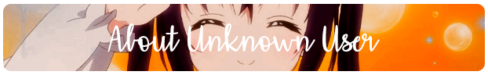
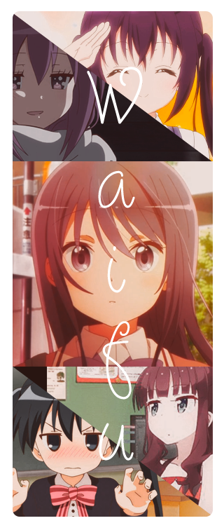
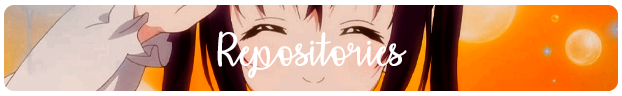

 

 
 
  
- Name **Unknown User**

- Live in **Avion, France**
  
- Student in **Robespierre, 1SN** 

- Studying [***Programmation And Network***](https://www.eccouncil.org/programs/certified-network-security-course/)

- Good with **Javascript** & **NodeJS**

- Have experience with **Photoshop**

- Understand French, & English

 

 
 
  
- 📗 [***Unknown-user-dev/OniStatusGame***](https://github.com/Unknown-user-dev/OniStatusGame)  
  A Bot discord status for your server!
- 📘 [***Unknown-user-dev/Uniria-UFW***](https://github.com/Unknown-user-dev/Uniria-UFW)  
  A Firewall config UFW for linux !
- 📕 [***Unknown-user-dev/MinasoGen***](https://github.com/Unknown-user-dev/MinasoGen)  
  A Password Generator with Base64 !
- 📙 [***Unknown-user-dev/Ascii-To-Hex***](https://github.com/Unknown-user-dev/Ascii-To-Hex)  
  A tool in python to learn Ascii To Hexa !

 
 
  
 *“People with a lack of confidence are often people with a hard and strong mind.†– Unknown* 

